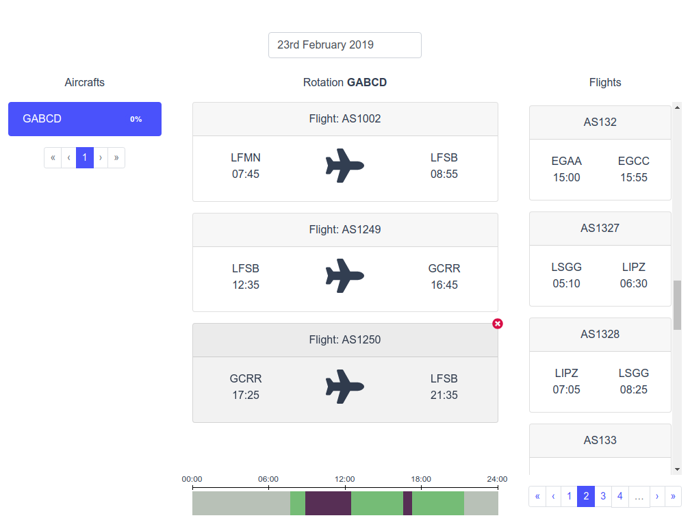

# Aircraft scheduling app

App serves for aircraft scheduling on specific date in an intuitive and easy way for airline owners. It gives more control of this process in comparison with processes automation by PC.

 


## Browsers support

Currently app has been developed and tested only in [Chrome](https://www.google.com/chrome/).


## Project structure

Application is built with [Vue.js](https://vuejs.org/). 
For stylization well known [Bootstrap CSS framework](https://getbootstrap.com/) is used. And actually its wrapper for Vue.js which is [bootstrap-vue](https://bootstrap-vue.js.org/) addon. 

[Vuex](https://vuex.vuejs.org) is used for storage of state of "Aircraft scheduling" Application. 
For fetching data **air.service** is used as a middleware which provides more simpler interface to communicate with *aircraft API*.


```bash
├── config
├── docs
├── public
├── src
|   ├── api
|   ├── assets
|   ├── components
|   ├── data
|   ├── store
|   ├── styles
|   └── utils
└── tests
```

### config

Configs for webpack, tests, environment variables, scss, post css, etc. All configuration files are connected in the `vue.config.js` file in the root of project.

### docs

Documentation of the "Aircraft scheduling" app.

### public

Container files for launching app: index.html, favicon.ico, etc.

### src

Source files of "Aircraft scheduling" app: styles, components, store, etc.

### tests

Automated unit tests for "Aircraft scheduling" application.

## Source of the project

Source files of the project are placed inside **src** folder. Lets take a look at it a little bit closer. The main constructed blocks are components. Component represents file where template, UI logic and behavior (script) and stylization of component's markup is placed. Components are stored in **src/components** folder.

ES6+ is used for logic on UI, user interactions, elements behavior.

[SCSS](https://sass-lang.com) preprocessor is used for stylization. Styles specific to component are defined in the same file where template and logic is placed. Markup in components is structured according [BEM](http://getbem.com/) methodology and elements class names are set accordingly. [Bemify](https://franzheidl.github.io/bemify/) library provides mixins for these purposes.
Application variables used in styles and other settings are placed in **src/styles**. These settings are included in the app from **config/sass.conf.js** file. All other third-party addons for stylization can be included in the app here.
There are 2 libraries which used for responsiveness of the Application:
 - [breakpoint-sass](http://breakpoint-sass.com/)
 - [breakpoint-slicer](https://github.com/lolmaus/breakpoint-slicer)

They provide mixins for using media-queries.

Icon set is taken from [Font Awesome](https://fontawesome.com/) library. All used icons are included in **main.js** file.

Entry point is **main.js** file. Global components are defined here, also app is initialized and rendered on the page from here.

All static data used by "Aircraft scheduling" app like list of error messages, list of dimension cells for timeline, etc is placed inside **src/data** folder.

**src/utils** folder serves for different helper functions used throughout "Aircraft scheduling" components. Such functions/helpers like remove duplicate elements from array, remove specific element from array, repeated functions for store, etc.

For all kind of files which can't be placed inside other directories but are used by "Aircraft scheduling" app there is folder named Assets **src/assets**. Currently there are images.

## Project setup
```
npm install
```

### Compiles and hot-reloads for development
```
npm run serve
```

### Compiles for development
```
npm run build:dev
```

### Compiles and minifies for production
```
npm run build
```

### Lints and fixes files
```
npm run lint
```
[ESLint](https://eslint.org/) helps to detect errors and potential problems in JavaScript code. Also pre-commit hook helps to keep code consistent throughout the App among different developers.

### Run unit tests
```
npm run test:unit
```

Config files for tests are placed in the config folder:

 - [Karma](https://karma-runner.github.io/) settings: pattern of test files, frameworks to use: [Jasmine](https://jasmine.github.io/), [Chai](https://www.chaijs.com/)
 - Browsers which have to be supported by app
 - Code coverage reports settings
